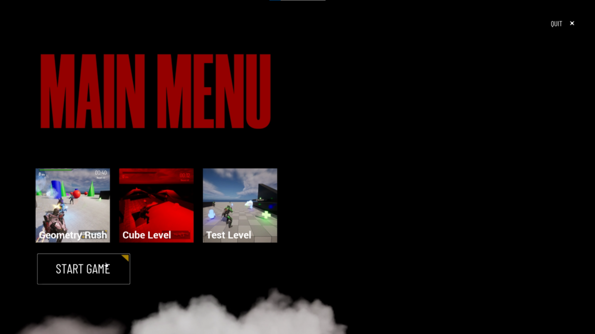
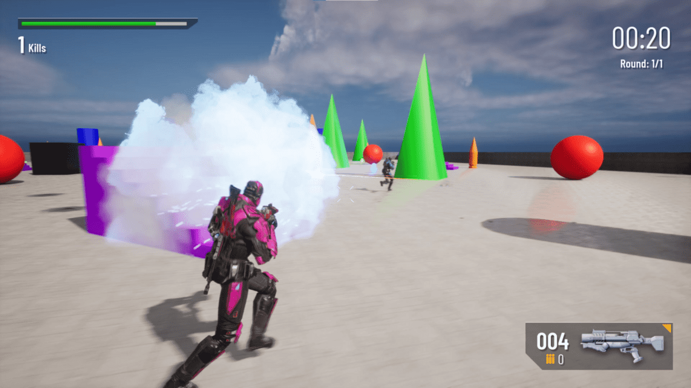
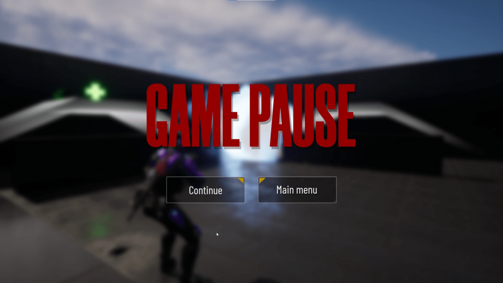
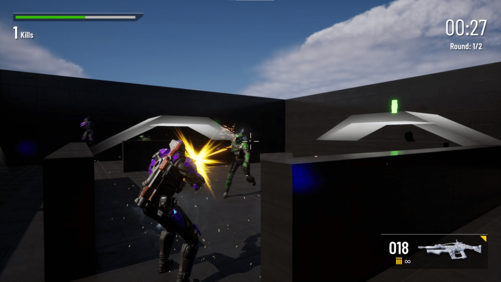
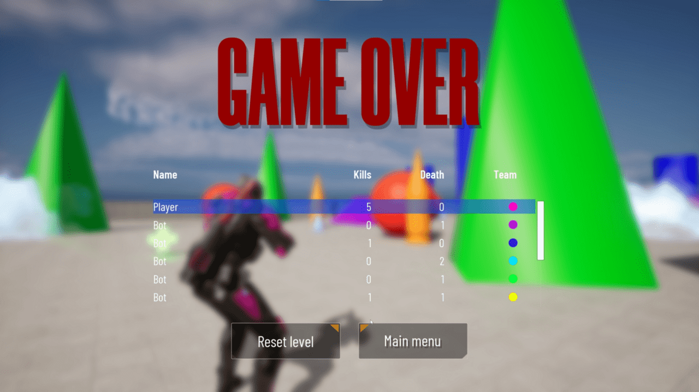
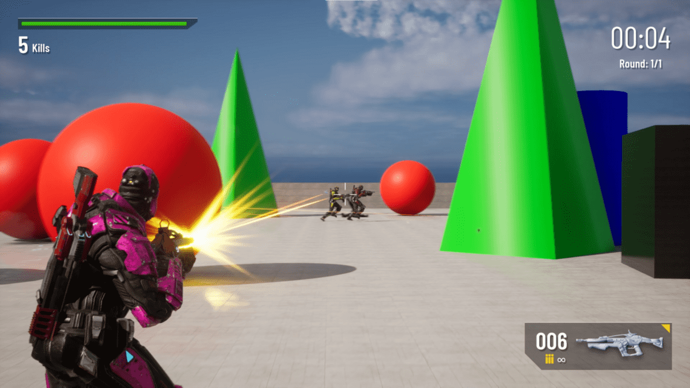

# ShooterPoligon

My third person shooter game created during the [«Unreal Engine — The Complete Guide to C++ Development»](https://www.udemy.com/course/unrealengine/) Udemy course.

Some screenshots of what I have already made:

  
  
  
  
  
  

---

Topics coverd by me during this project:

* Unreal Framework: core classes, types, macros, delegates, property system

* Animation programming: state machine, FABRIK, anim notifies

* UMG: user interfaces

* Artificial intelligence: behavior trees, tasks, services, decorators, EQS

* Sound Control: SoundCue, SoundClass, SoundMix, Attenuation settings

* Controlling the game process: GameMode, PlayerState, GameInstance

